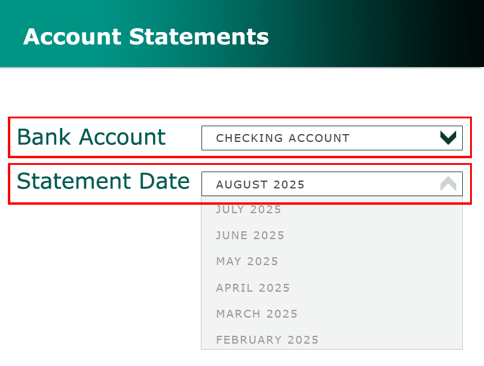

# How do I view or download account statements?

You can view or download your account statements through **Account Statements** to review past activity, verify transactions, or save copies for your records.

**On VeridaBank Online**

1.	Select **Account Statements**.
2.	Filter by **Bank Account** and **Statement Date**. 

     
3.	To view a statement, click (or tap) **View**. 
4.	To download a statement, click (or tap) the **Download** icon .
