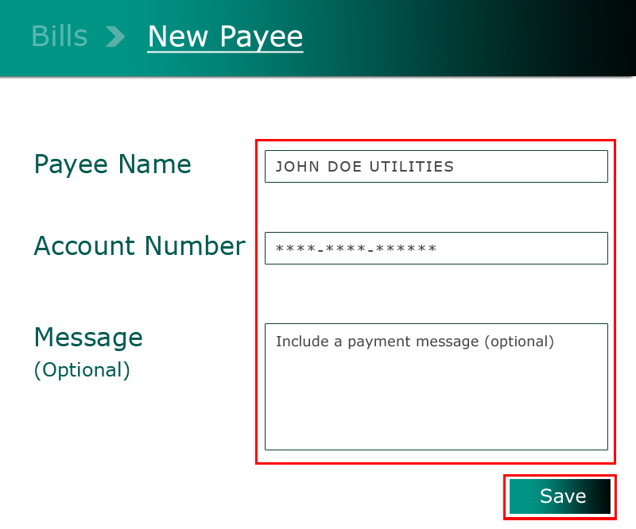

# How do I pay bills?

VeridaBank Online provides support for online bill payments, enabling you to set up payees, manage existing payee details, and submit payments securely from your account.

**On VeridaBank Online**

1.	Go to **Payments** > **Bills**.

2.	Create or reuse payee details: 
    -	*New payee*:

        1. Click (or tap) **New Payee**.

             

        2. Enter the required payee details (e.g., account number).
        3. Click (or tap) **Save**.

    - *Previous payee*:
        1.	Open the dropdown under **Previous Payees**.
        2.	Select the payee.

3.	Enter the payment amount.

4.	Click (or tap) **Pay**.

???+ info "Tip"
    Bill payments may take up to *72 hours (3 business days)* to process. Contact us if your payment is still marked as "Pending".
