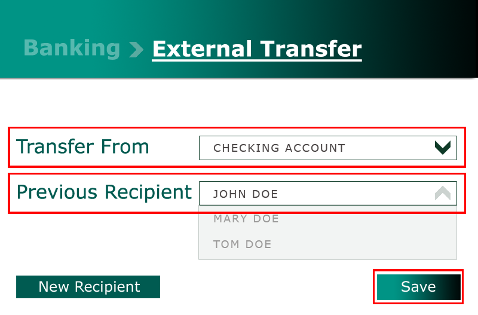

# How do I transfer funds to another person?

You can transfer funds to a recipient through our online platform, even if they're not banking with VeridaBank.

**On VeridaBank Online**

1.	Go to **Banking** > **External Transfer**.
2.	In the **Transfer From** dropdown, select the account you’re transferring from (e.g., Checking).
3.	Add or reuse recipient details:

    - *First-time recipient*:     
            &nbsp;&nbsp;&nbsp;&nbsp;&nbsp;&nbsp;a. Click (or tap) **New Recipient**. 
            &nbsp;&nbsp;&nbsp;&nbsp;&nbsp;&nbsp;b. Enter the required recipient details (e.g., recipient name, email address, payment &nbsp;&nbsp;&nbsp;&nbsp;&nbsp;&nbsp;&nbsp;&nbsp;&nbsp;&nbsp;message). 
            &nbsp;&nbsp;&nbsp;&nbsp;&nbsp;&nbsp;c. Click (or tap) **Save**.  

    - *Previous recipient*:  

            
             &nbsp;&nbsp;&nbsp;&nbsp;&nbsp;&nbsp;a. Open the dropdown for **Previous Recipient**. 
            &nbsp;&nbsp;&nbsp;&nbsp;&nbsp;&nbsp;b. Select the recipient. 
            &nbsp;&nbsp;&nbsp;&nbsp;&nbsp;&nbsp;c. Click (or tap) **Save**.
    
4. Enter the transfer amount.
5. Click (or tap) **Transfer**.

???+ info "Tip"
    Transfers to other banks may take up to *72 hours (3 business days)* to process. Contact us if your transfer is still marked as "Pending".