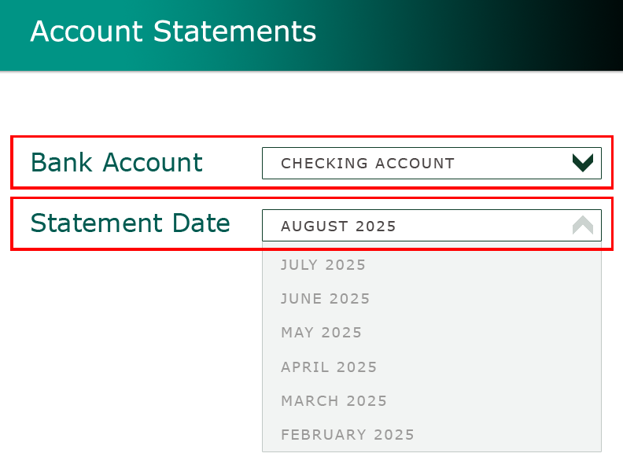

# Where can I find my account statements?

**On VeridaBank Online**

1.	Select **Account Statements**.
2.	Filter by bank account and statement date. 

     
3.	To view a statement, click (or tap) **View**. 
4.	To download a statement, click (or tap) the **Download** icon .
